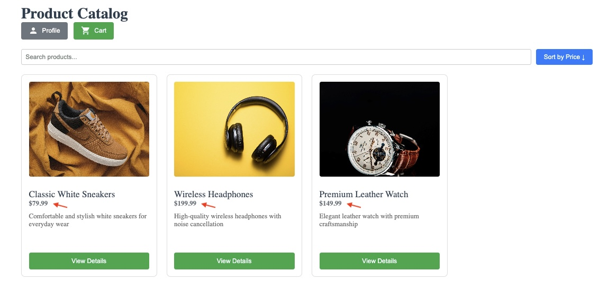
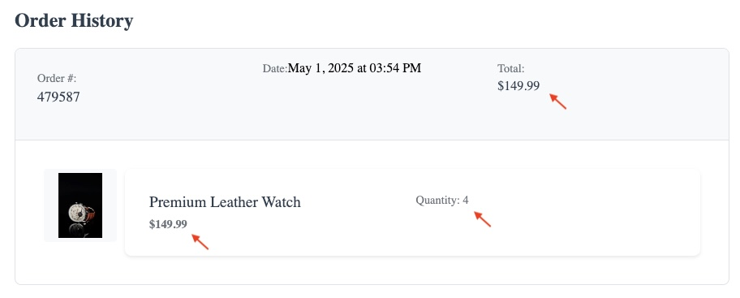

# 🧪 QA Findings Report – E-commerce Challenge

_Last updated: May 01, 2025_

This document summarizes all bugs and improvement suggestions identified during automated and manual testing of the e-commerce application.

---

## ❌ Bugs

### 🚨 1. Product Sorting Is Broken

**Description:**  
Sorting products by price (ascending/descending) does not update the list correctly.

**Expected Behavior:**  
Products should be ordered from lowest to highest price (or vice versa).

**Steps to Reproduce:**
1. Go to the Home Page.
2. Use the sort button.
3. Select "Sort by Price ↑" or "Sort by Price ↓".
4. Check product order.

**Related Test Scenarios:**
- `Sort products by price ascending`
- `Sort products by price descending`

**Status:** ❌ Failing in automation

**Screenshot:**  

---

### 🚨 2. Order History Price Total Is Incorrect

**Description:**  
The "Total" value displayed in the Order History does not match the actual sum of (unit price × quantity).

**Expected Behavior:**  
The total should reflect the correct calculation of the order based on selected quantity and unit price.

**Steps to Reproduce:**
1. Complete a purchase with quantity greater than 1 (e.g., 3 or 4).
2. Go to the Profile page.
3. Look at the last order in the history.
4. Compare the total shown vs. the expected value.

**Impact:**  
Can mislead users about what was paid, impacting trust and financial accuracy.

**Related Test Scenario:**
- `Scenario: Complete flow ends in profile page`

**Screenshot:**  

---

### 🚨 3. Cancel Profile Edit Does Not Discard Changes

**Description:**  
Clicking "Cancel" after editing the profile does not discard changes. The edited name and email remain visible.

**Expected Behavior:**  
Original profile data should be restored after clicking "Cancel".

**Steps to Reproduce:**
1. Go to the Profile page.
2. Click "Edit Profile".
3. Change the name and email.
4. Click "Cancel".
5. Observe that the edited values persist.

**Related Test:**  
- `Scenario: Cancel editing profile`

**Status:** ❌ Failing in automation

**Note:** This bug involves a dynamic interaction. A static screenshot may not reflect the failure accurately — ideally, this should be demonstrated via screen recording or automated test video output.

---

## 🛠️ Suggested Improvements

### ⚠️ 1. CVV Field Allows Non-Numeric Characters While Typing

**Description:**  
The CVV input accepts alphabetic characters during typing (e.g., "abc"), but eventually displays a validation error and prevents form submission.

**Expected Behavior:**  
Ideally, the input should restrict entry to numeric characters only (e.g., using `inputmode="numeric"` or pattern validation).

**Suggestion:**  
Apply an input mask or validation rule to allow only digits in real-time.

**Observed Validation Message:**  
"CVV must be 3 or 4 digits"

**Status:** ⚠️ UX Improvement

**Related Test Scenario:**  
- `Scenario: Show error for short CVV input`

---

### ⚠️ 2. Only First Address Field Shows HTML5 Validation on Submit

**Description:**  
Clicking "Continue to Payment" with all fields empty triggers native validation only on the first field.

**Expected Behavior:**  
All required fields should show validation messages consistently on submit.

**Suggestion:**  
Use custom validation logic or trigger all field checks before submitting.

---

### ⚠️ 3. Expired Dates Accepted in Payment

**Description:**  
The expiry date field accepts past dates without warning.

**Expected Behavior:**  
The system should reject expired cards and prompt the user accordingly.

**Suggestion:**  
Add logic to validate that the date is not in the past.

---

## ✅ Validated Bug Scenarios

The following test cases were created and are actively failing due to verified bugs:

- `Scenario: Cancel editing profile`
- `Scenario: Sort products by price ascending`
- `Scenario: Sort products by price descending`

---

## 📌 Notes

- All scenarios were implemented with **Cypress + Cucumber + TypeScript**.
- Test selectors were based on `data-testid` attributes for stability.
- Screenshots are saved in `/screenshots/` and referenced in this report.
- All test steps are reusable and aligned with expected user behavior.
