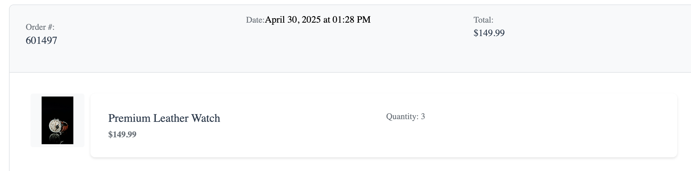
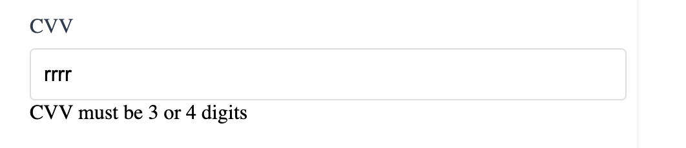
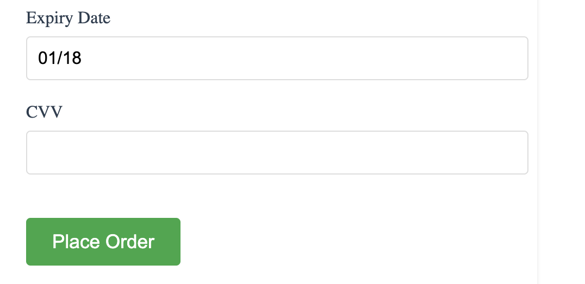

# QA Issues Report

This document outlines functional and visual bugs discovered during the testing of the eCommerce application.

---

### 1. Sorting Error on Homepage

- **Expected**: Products should be sorted entirely by price in ascending or descending order.
- **Actual**: Only the first and last items are repositioned correctly; the middle item remains static, breaking the sort order logic.

**Screenshot**: 

---

### 2. Incorrect Order Total Calculation in Order History

- **Expected**: The total price in the order history should reflect the item's `price × quantity`, consistent with the cart total.
- **Actual**: The order page displays only the unit price per item, regardless of the quantity purchased.

**Screenshot**:  

---

### 3. CVV Field Accepts Letters

- **Expected**: The CVV input should restrict entry to numeric characters only (3–4 digits).
- **Actual**: Alphabetical characters can be entered into the field, though later rejected by validation.

**Screenshot**:  

---

### 4. Expired Credit Cards Are Not Validated

- **Expected**: Expiry date should be compared against the current date. If the date is in the past, an error should prevent the payment from proceeding.
- **Actual**: Expired dates (e.g., `01/18`) are accepted and the payment is processed successfully.

**Screenshot**:  

---
